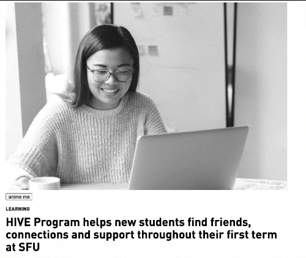
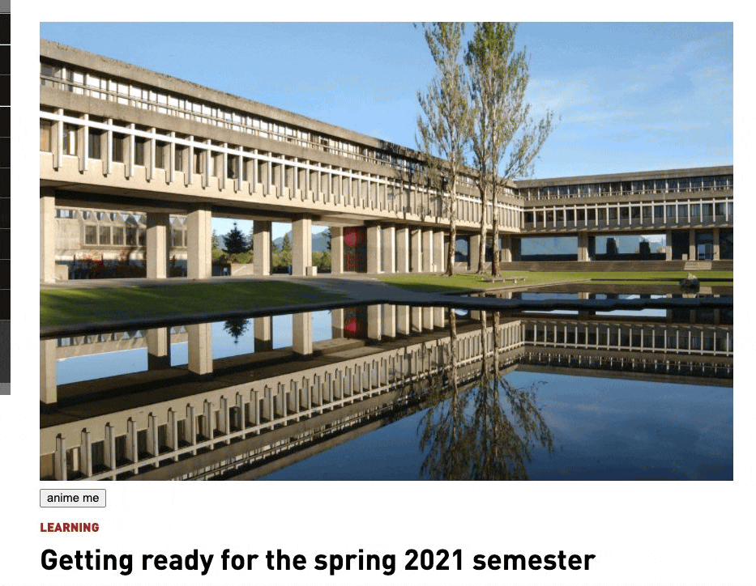

--------------------------
Anime
Screen
Conversion
Image
Ixtension
--------------------------

This project was developed as part of the CSSS Fall Hack 2020!
Contributors to this project are:
- Parsa A.
- Ari B.
- Cameron H.
- Jasper X.
- Hansoo Y.

How to use this extension:
-----------------------------

As of right now, this requires the use of a UNIX device to run the Gunicorn WSGI server.

1. Clone/download the repo
2. Go into Google Chrome Extensions (chrome://extensions/), and select "Load Unpacked".
    Navigate to the Extension file in the cloned repo, and load it.
3. Install Python3 and pip.
4. Navigate to the repo directory and run
    ```pip install requirements.txt```
5. Run ```gunicorn server:app --workers=2```
6. Go to Google Chrome, and use the extension by either rightclicking on any page, or using the extension icon at the top.
7. **VERY IMPORTANT: CLICK ANIME ME TWICE**
    Otherwise, the image will not load.
8. If you know why 7 happens and how to fix it, pls tell us

Here it is in action
----




Test it out for yourself on websites that don't cache photos, and where clicking photos doesn't redirect you!
E.G.
http://www.sfu.ca/sfunews/stories/2020/09/the-hive-program-helps-new-students-find-friends--connections-an.html

https://images.pexels.com/photos/2444403/pexels-photo-2444403.jpeg

Before:


After:

